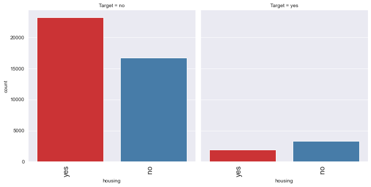

# Subscription_Prediction
## Data Description:
The dataset contains data on 45211 customers, and 17 features. The data include customer demographic information (age, education,marital etc.), data related to the prvious conatct
(contact,duration etc) and the Whether the client subscribed to the Term deposit (Target).
## Domain
Banking
## Context
This case is about a Marketing team who wants to explore ways of identifying the new incoming customers who are more likely to subscribe to a term deposit.This is done to increase the hit ratio of the Marketing team
## Objective:
The classification goal is to predict the likelihood of a customer subscribing to Term Deposit
## Packages Used
* Pandas
* Numpy
* Matplotlib/Seaborn
* sklearn

## Exploratory Data Analysis

  

### Feature Importance

The Top 3 features that influence the prediction of the Target Variable (The customer is likelt to subscibe to Term Deposit) are:
* duration
* pdays
* Housing_yes

### Business Understanding and Inference:

Random Forest Classifier is the best model in this scenario as it has high Recall (False Negative is lowest among all the models), high Accuracy and high f1 score
